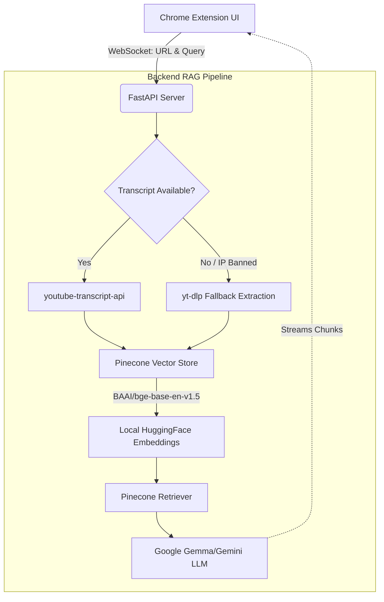

<div align="center">
  
  
  <h1 align="center">YouTube RAG Assistant</h1>
  <p align="center">
    <strong>A highly robust, production-ready AI agent that lets you chat directly with long-form YouTube videos.</strong>
    <br />
    <br />
    <a href="#features">Features</a>
    ·
    <a href="#architecture">Architecture</a>
    ·
    <a href="#quick-start">Quick Start</a>
    ·
    <a href="#tech-stack">Tech Stack</a>
  </p>
</div>

---

## 📖 Overview

The **YouTube RAG Assistant** is a comprehensive full-stack solution (Chrome Extension + FastAPI Backend) designed to eliminate the inefficiency of manually scrubbing through hours of video content. By leveraging a state-of-the-art **Retrieval-Augmented Generation (RAG)** pipeline, it allows users to ask complex questions, generate executive summaries, and instantly seek to specific timestamps within any YouTube video. 

Built with resilience in mind, the backend features automatic IP-ban evasion fallbacks and seamlessly streams AI responses via WebSockets for a native, real-time user experience.

---

## ✨ Features

- ⚡ **Real-Time Streaming** — Powered by WebSockets, responses stream back instantly with a dynamic typing indicator, mimicking a natural chat interface.
- 🧠 **Context-Aware Memory** — The LLM retains conversation history, allowing for fluid follow-up questions and deep-dives into specific video topics.
- 🎯 **Interactive Timestamps** — AI-generated answers include inline timestamp citations (e.g., `[14:20]`). Clicking these citations instantly scrubs the active YouTube video to that exact moment.
- 🛡️ **Robust Anti-Ban System** — YouTube frequently blocks IPs from downloading transcripts. This pipeline gracefully catches rate limits and falls back to a covert `yt-dlp` extraction module to guarantee transcript availability.
- 📊 **One-Click Summaries** — Instantly generate an executive overview and key takeaways for any video without having to watch it.

---

## 🏗️ Architecture

The system is decoupled into a lightweight frontend extension and a heavy-lifting Python backend, orchestrated via Pinecone and local HuggingFace embeddings.



---

## 🛠️ Tech Stack

### Frontend (Chrome Extension)
* **Vanilla JavaScript** (ES6+) for ultra-lightweight performance
* **Chrome Extensions API v3** (Content Scripts, Message Passing)
* **CSS3** with modern custom properties and flexbox architecture

### Backend (Python)
* **FastAPI** for high-performance, asynchronous REST & WebSocket endpoints
* **LangChain** for orchestrating the RAG pipeline and conversational retrieval
* **Pinecone** for scalable, high-dimensional vector similarity search
* **HuggingFace** (`BAAI/bge-base`) for state-of-the-art local embeddings (zero API cost)
* **Google Generative AI** for the core conversational LLM engine
* **Uvicorn** & **Gunicorn** for production server deployment

---

## 🚀 Quick Start

### 1. Backend Setup

Clone the repository and spin up the Python environment:

```bash
# 1. Clone the repo
git clone https://github.com/YOUR_USERNAME/yt_assistant_plugin.git
cd yt_assistant_plugin

# 2. Create and activate a virtual environment
python -m venv .venv
source .venv/bin/activate  # On Windows use: .venv\Scripts\activate

# 3. Install dependencies
pip install -r requirements.txt
```

Create a `.env` file in the root directory and add your API keys:

```env
GOOGLE_API_KEY="your-google-api-key"
PINECONE_API_KEY="your-pinecone-api-key"
PINECONE_INDEX_NAME="your-pinecone-index-name"
```

Boot the server:

```bash
uvicorn backend.app:app --host 0.0.0.0 --port 8000
```
*(Note: The first launch may take 15-30 seconds as the HuggingFace embedding models are downloaded and cached locally).*

### 2. Frontend Setup

1. Open Google Chrome and navigate to `chrome://extensions/`
2. Toggle **Developer mode** in the top right corner.
3. Click **Load unpacked** and select the `chrome_extension` folder from this repository.
4. Pin the extension to your toolbar!

### 3. Usage

1. Open any YouTube video.
2. Click the extension icon. It will automatically detect the video ID.
3. Ask a question! The backend will chunk the transcript, embed it into Pinecone, and stream the AI's answer back to you.

---

## ☁️ Cloud Deployment

This project is fully containerized and production-ready. For cloud deployment (e.g., Render, Railway, AWS):

1. Connect your GitHub repository to your host.
2. Set your Build Command to: `pip install -r requirements.txt`
3. Set your Start Command to: `uvicorn backend.app:app --host 0.0.0.0 --port $PORT`
4. Add your `.env` secrets to the host's environment variables.
5. **Important:** Update `BACKEND_URL` on line 2 of `chrome_extension/popup.js` to point to your new live server URL.

---

## 🤝 Contributing

Contributions, issues, and feature requests are welcome! Feel free to check the [issues page](https://github.com/YOUR_USERNAME/yt_assistant_plugin/issues).

## 📝 License

This project is [MIT](https://choosealicense.com/licenses/mit/) licensed.
