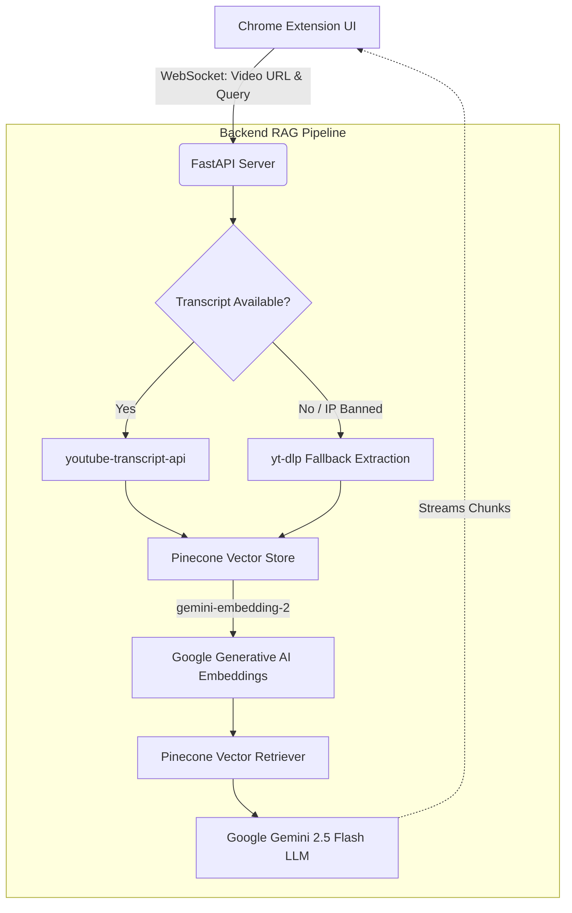

# YouTube AI Assistant (RAG Pipeline)

A production-ready Chrome Extension and FastAPI backend that allows you to chat with any YouTube video and generate timestamped summaries.

This project implements a Retrieval-Augmented Generation (RAG) architecture using Google Generative AI embeddings, Pinecone vector search, and Google's cutting-edge Gemini LLM to answer complex queries about long-form video content instantly.

## Architecture

The system is built on a highly resilient streaming architecture with automatic IP-ban evasion fallbacks.



## Features

- **Real-time Streaming Responses:** Powered by WebSockets, you get answers instantly as the LLM thinks, accompanied by a dynamic WhatsApp-style typing indicator.
- **Robust Anti-Ban System:** If YouTube blocks your IP from downloading transcripts due to rate limiting, the backend seamlessly falls back to `yt-dlp` to extract `.vtt` subtitles under the radar.
- **Advanced Context Retrieval:** Uses Pinecone Vector Store dense retrieval paired with Google Generative AI Embeddings for high accuracy.
- **Interactive Timestamps:** Click any timestamp (e.g., `[14:20]`) in the assistant's response to instantly jump the YouTube video to that exact moment.
- **Memory-Aware Chat:** The assistant remembers your previous questions so you can ask follow-ups naturally.

## Installation & Setup

1. **Backend Server**
   ```bash
   python -m venv .venv
   source .venv/bin/activate  # On Windows: .venv\Scripts\activate
   pip install -r requirements.txt
   ```

2. **Environment Variables**
   Create a `.env` file in the root directory:
   ```env
   GOOGLE_API_KEY="your-gemini-api-key"
   PINECONE_API_KEY="your-pinecone-api-key"
   PINECONE_INDEX_NAME="your-pinecone-index-name"
   ```

3. **Run the Server**
   ```bash
   python -m uvicorn backend.app:app --host 127.0.0.1 --port 8000
   ```

4. **Install the Chrome Extension**
   - Open Chrome and navigate to `chrome://extensions/`
   - Enable **Developer mode**
   - Click **Load unpacked** and select the `chrome_extension` folder.
   - Open any YouTube video and click the extension icon to start chatting!
