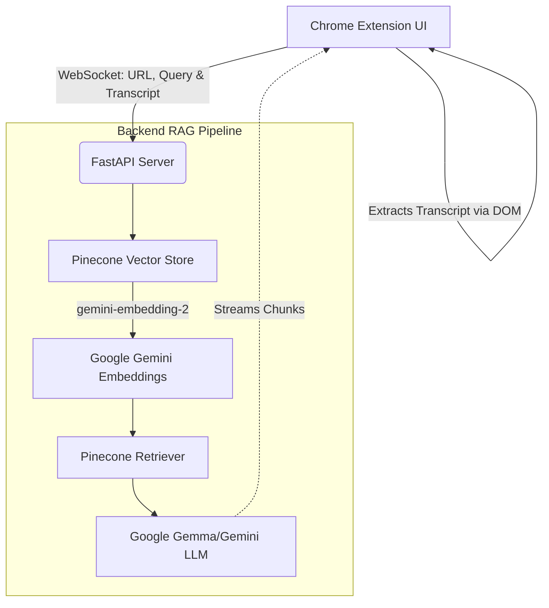

<div align="center">
  
  
  <h1 align="center">YouTube RAG Assistant</h1>
  <p align="center">
    <strong>A highly robust, production-ready AI agent that lets you chat directly with long-form YouTube videos.</strong>
    <br />
    <br />
    <a href="#features">Features</a>
    ·
    <a href="#architecture">Architecture</a>
    ·
    <a href="#quick-start">Quick Start</a>
    ·
    <a href="#tech-stack">Tech Stack</a>
  </p>
</div>

---

## 📖 Overview

The **YouTube RAG Assistant** is a comprehensive full-stack solution (Chrome Extension + FastAPI Backend) designed to eliminate the inefficiency of manually scrubbing through hours of video content. By leveraging a state-of-the-art **Retrieval-Augmented Generation (RAG)** pipeline, it allows users to ask complex questions, generate executive summaries, and instantly seek to specific timestamps within any YouTube video. 

Built with extreme resilience in mind, the frontend extension leverages native DOM memory extraction to bypass YouTube API restrictions and EU consent walls, seamlessly feeding transcripts to the cloud backend for processing.

---

## ✨ Features

- ⚡ **Real-Time Streaming** — Powered by WebSockets, responses stream back instantly with a buttery-smooth Visual Typewriter queue to mask network jitter.
- 🧠 **Context-Aware Memory** — The LLM retains conversation history, allowing for fluid follow-up questions and deep-dives into specific video topics.
- 🎯 **Interactive Timestamps** — AI-generated answers include inline timestamp citations (e.g., `[14:20]`). Clicking these citations instantly scrubs the active YouTube video to that exact moment.
- 🛡️ **Bulletproof Extraction** — Completely bypasses YouTube API limits and Cloud IP bans by natively extracting transcript JSON3 data directly from the active `movie_player` HTML5 memory via `chrome.scripting`.
- 📊 **One-Click Summaries** — Instantly generate an executive overview and key takeaways for any video without having to watch it.
- 🚦 **Robust API Scaling** — Implements exponential backoff retry loops and in-memory caching to intelligently manage Google GenAI token rate-limits for massive videos.

---

## 🏗️ Architecture

The system is decoupled into a lightweight Chrome Extension frontend and a heavy-lifting Python backend, orchestrated via Pinecone and Google Gemini embeddings.



---

## 🛠️ Tech Stack

### Frontend (Chrome Extension)
* **Vanilla JavaScript** (ES6+) for ultra-lightweight performance
* **Chrome Extensions API v3** (Content Scripts, MAIN world scripting)
* **CSS3** with modern custom properties and flexbox architecture

### Backend (Python)
* **FastAPI** for high-performance, asynchronous REST & WebSocket endpoints
* **LangChain** for orchestrating the RAG pipeline and conversational retrieval
* **Pinecone** for scalable, high-dimensional vector similarity search
* **Google Generative AI** (`gemini-embedding-2` for embeddings and conversational LLM engine)
* **Uvicorn** & **Gunicorn** for production server deployment

---

## 🚀 Quick Start

### 1. Backend Setup

Clone the repository and spin up the Python environment:

```bash
# 1. Clone the repo
git clone https://github.com/YOUR_USERNAME/yt_assistant_plugin.git
cd yt_assistant_plugin

# 2. Create and activate a virtual environment
python -m venv .venv
source .venv/bin/activate  # On Windows use: .venv\Scripts\activate

# 3. Install dependencies
pip install -r requirements.txt
```

Create a `.env` file in the root directory and add your API keys:

```env
GOOGLE_API_KEY="your-google-api-key"
PINECONE_API_KEY="your-pinecone-api-key"
PINECONE_INDEX_NAME="your-pinecone-index-name"
```
**Important:** Your Pinecone index must be created with a **dimension of 3072** and a metric of `cosine` to correctly align with the Gemini embeddings.

Boot the server:

```bash
uvicorn backend.app:app --host 0.0.0.0 --port 8000
```

### 2. Frontend Setup

1. Open Google Chrome and navigate to `chrome://extensions/`
2. Toggle **Developer mode** in the top right corner.
3. Click **Load unpacked** and select the `chrome_extension` folder from this repository.
4. Pin the extension to your toolbar!

### 3. Usage

1. Open any YouTube video.
2. Click the extension icon. It will automatically detect the video ID.
3. Ask a question! The frontend will grab the transcript from the live video, send it to the backend, embed it into Pinecone, and stream the AI's answer back to you.

---

## ☁️ Cloud Deployment

This project is fully containerized and production-ready for extremely low-RAM environments (runs flawlessly on Render's 512MB free tier).

1. Connect your GitHub repository to your host.
2. Set your Build Command to: `pip install -r requirements.txt`
3. Set your Start Command to: `uvicorn backend.app:app --host 0.0.0.0 --port $PORT`
4. Add your `.env` secrets to the host's environment variables.
5. **Important:** Update `BACKEND_URL` on line 2 of `chrome_extension/popup.js` to point to your new live server URL.

---

## 🤝 Contributing

Contributions, issues, and feature requests are welcome! Feel free to check the [issues page](https://github.com/YOUR_USERNAME/yt_assistant_plugin/issues).

## 📝 License

This project is [MIT](https://choosealicense.com/licenses/mit/) licensed.
